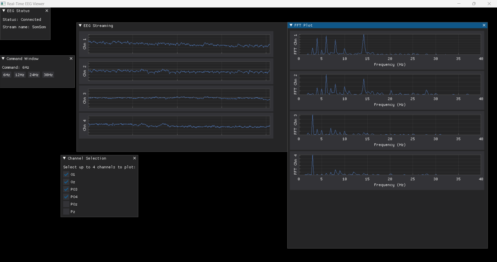

# Real-time EEG Monitoring with Python

This project aims to create an EEG GUI for a real-time graph and to be the BCI approach for sending the predicted SSVEP command to Unity.

**If you want to use it, Please follow Instruction.pdf**   

# Authors
1. Sirapakit Limtragooltongchai (sirapakit.lim@gmail.com)
2. Suparach Intarasopa (suparach.int@gmail.com)
   
Neuroscience Center for Research and Innovation
King Mongkut's University of Technology Thonburi, Thailand
